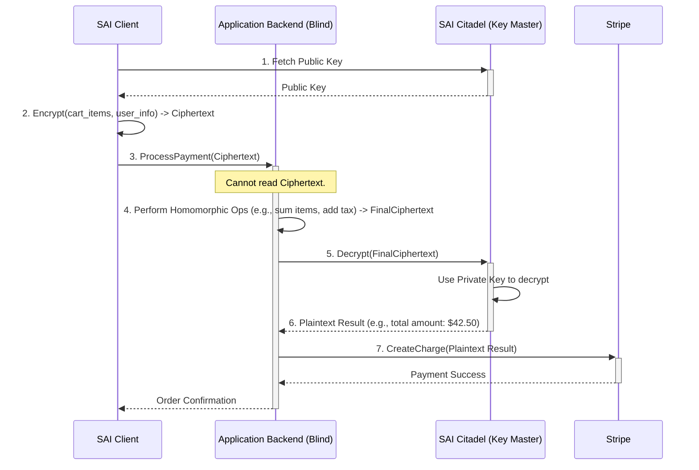

# SAI - Secure Application Interchange - Architectural Ideas

This document captures brainstorming and architectural visions for the SAI protocol. The guiding principle is to move beyond securing the communication channel and instead design a system that can operate without ever needing to "see" the sensitive data it processes.

## Core Vision: The Blind Operator

The fundamental idea is to treat our own backend application as an "untrusted" worker. It should be able to execute business logic (like calculating the total of an order) on data that remains encrypted from the moment it leaves the user's browser until the moment it needs to be sent to an external, trusted party (like a payment gateway).

This is inspired by the cryptographic concept of **Homomorphic Encryption (HE)**.

### Analogy: The Locked Box

Imagine you have a locked box (the encrypted data). You give this box to a worker (our backend). You also give them a special set of tools that allow them to work on the contents of the box *without ever opening it*. They can add things, remove things, or combine things inside, but they can never see what they are. When they are done, they give the box back to you, and only you have the key to open it and see the final result.

In this model, **SAI is the provider of the box, the tools, and the key.**

---

## Architectural Proposal: SAI as a Homomorphic Encryption Broker

We will architect SAI as a three-part system:

1.  **The SAI Citadel (The Key Master):**
    *   A new, completely isolated, and highly secured microservice.
    *   Its **only** purpose is to generate and guard the private key for the homomorphic encryption scheme.
    *   It exposes a public endpoint to distribute the **public key** to clients.
    *   It exposes a ruthlessly protected internal endpoint to perform the final **decryption**. No other service can do this.

2.  **The SAI Client (The Frontend "Bot"):**
    *   A JavaScript library that runs in the user's browser.
    *   When a sensitive operation begins (e.g., checkout), it fetches the public key from the SAI Citadel.
    *   It encrypts the entire sensitive payload (e.g., the shopping cart, the payment details) into a "homomorphic ciphertext" before sending it to the backend.

3.  **The Application Backend (The "Blind Calculator"):**
    *   Our main Spring Boot application.
    *   It **never** sees plaintext data for sensitive operations. It receives the homomorphic ciphertext from the frontend.
    *   It uses a special library (the HE "tools") to perform calculations directly on the ciphertext. For example, it can "add" two encrypted numbers to get a new encrypted number representing the sum.
    *   After processing, it sends the final, still-encrypted result to the SAI Citadel for decryption right before it's needed by an external service (e.g., Stripe).

### Visualizing the Payment Flow



### Brainstormed Ideas for Implementation

1.  **Idea: The Citadel as a Vault.**
    *   Build the SAI Citadel as a minimal Spring Boot application using a library like HashiCorp Vault for key management. Its API surface should be tiny: `GET /sai/v1/public-key` and `POST /sai/v1/decrypt`.

2.  **Idea: The Blind Calculator Library.**
    *   Research and choose a suitable Homomorphic Encryption library for Java (e.g., Microsoft SEAL, Lattigo, or others).
    *   Create a service within our main backend, e.g., `HomomorphicPaymentService`, that contains the logic for performing the blind calculations.

3.  **Idea: The Secure Envelope.**
    *   Develop a corresponding JavaScript library (`sai-client.js`) that can be included in the frontend. This library will handle the fetching of the public key and the encryption of the data into the format the backend library expects.

4.  **Idea: The Untraceable Audit Log.**
    *   Even though the backend is blind to the data, we still need to audit the operations. The backend would log events like: `Processed homomorphic transaction with ID [ciphertext_hash] for user with ID [encrypted_user_id]`. This log proves an operation happened without revealing the sensitive data itself. Only the Citadel, by decrypting specific parts of the log, could reconstruct the full picture if needed for a forensic audit.
```