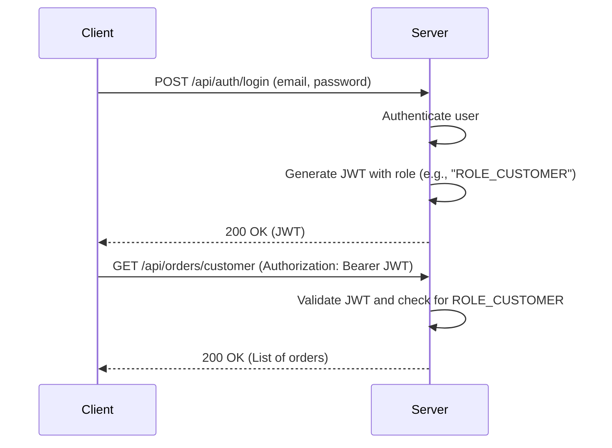

# Auntiees Food Order Management

This is a food order management system for Auntiees Cafe.

## Project Details

This project is a Spring Boot application that provides a REST API for managing food orders, users, and menu items. It uses JWT for authentication and authorization.

### Technologies Used:
- Java 17
- Spring Boot 3.3.4
- Spring Security
- Spring Data JPA (Hibernate)
- MariaDB
- Lombok
- JWT (jjwt)
- Thymeleaf (for email templates)
- **Redis**: For high-performance caching of menu and promotions.
- **RabbitMQ**: Message broker for asynchronous tasks and notifications.
- **Spring Boot Actuator**: For monitoring system health and hit metrics.

---

## Future Architecture: SAI (Secure Application Interchange) Protocol

To enhance security for internal service-to-service communication, this project will implement the **SAI Protocol**. This is a quantum-inspired security model designed to create a communication channel so intrinsically linked to the two communicating services that the message itself becomes secondary. The channel's existence *is* the proof of trust.

The protocol is based on the principle of a **synchronized, evolving state**.

### Core Principles

1.  **The Entanglement (The Handshake):**
    *   A central service, the **SAI Nexus**, acts as the "entanglement" source.
    *   When `Service A` wants to talk to `Service B`, it requests a secure channel from the Nexus.
    *   The Nexus generates a **single-use, high-entropy cryptographic seed** and securely delivers it to both services.
    *   Both services use this seed to initialize an identical, synchronized **Cryptographically Secure Pseudo-Random Number Generator (CSPRNG)**. This shared, evolving generator *is* the "entangled state."

2.  **The Communication (The "Observer Effect"):**
    *   To send a request, `Service A` pulls the **next value** (`key_n`) from its CSPRNG.
    *   It encrypts the request payload using `key_n` as a one-time symmetric key.
    *   It generates a **Transient Authentication Hash (TAH)**: `hash(encrypted_payload + key_n)`.
    *   The request sent over the wire contains only the `encrypted_payload` and the `TAH`. The key is never transmitted.

3.  **The Verification (Collapsing the Waveform):**
    *   `Service B` receives the request and pulls the **next value** from its own synchronized CSPRNG, which will be the same `key_n`.
    *   It calculates its own `expected_TAH` and compares it to the received `TAH`.
    *   If they match, the request is authentic and is decrypted using `key_n`. If not, it's rejected.
    *   The act of processing the request consumes the current state, and both services are ready for the next request, which will use a new key, `key_n+1`.

### UML Sequence Diagram

```mermaid
sequenceDiagram
    participant Client as Order Service
    participant Nexus as SAI Nexus
    participant Server as Payment Service

    Note over Client, Server: Initial State: Not Entangled

    %% 1. Entanglement Phase
    Client->>+Nexus: Request channel to "Payment Service"
    Nexus->>Nexus: Generate unique, high-entropy seed
    Nexus-->>-Client: Securely deliver seed
    Nexus-->>+Server: Securely deliver seed
    Note over Client: Initializes CSPRNG with seed
    Note over Server: Initializes CSPRNG with seed
    Server-->>-Nexus: Acknowledgment
    
    Note over Client, Server: State: Entangled & Synchronized

    %% 2. Communication Phase (for a single API call)
    Client->>Client: 1. Get next key (key_n) from CSPRNG
    Client->>Client: 2. Encrypt payload with key_n
    Client->>Client: 3. Generate TAH = hash(encrypted_payload + key_n)
    
    Client->>+Server: Send {encrypted_payload, TAH}

    Server->>Server: 1. Get next key (key_n) from own CSPRNG
    Server->>Server: 2. Calculate expected_TAH = hash(encrypted_payload + key_n)
    
    alt Hashes Match
        Server->>Server: 3. Decrypt payload with key_n
        Server->>Server: 4. Process the request
        Server-->>-Client: Encrypted Response
    else Hashes Do Not Match
        Server-->>-Client: Error: Authentication Failed
        Note over Client, Server: Channel may be terminated due to desynchronization
    end
```

---

## Endpoints

### Authentication

| Method | Endpoint             | Description                                                              | Access      |
|--------|----------------------|--------------------------------------------------------------------------|-------------|
| POST   | `/api/auth/register`   | Registers a new user. An OTP is sent to the user's email for verification. | Public      |
| POST   | `/api/auth/login`      | Authenticates a user and returns a JWT token.                            | Public      |
| POST   | `/api/auth/verify-otp` | Verifies the OTP sent to the user's email to activate the account.       | Public      |

### Admin & Cashier

| Method | Endpoint                   | Description                               | Access      |
|--------|----------------------------|-------------------------------------------|-------------|
| GET    | `/api/admin/users/search`  | Search for customers by name or email.    | ADMIN, CASHIER |
| GET    | `/api/admin/users`         | Get all users.                            | ADMIN       |
| POST   | `/api/admin/users`         | Create a new user.                        | ADMIN       |
| PUT    | `/api/admin/users/{userId}/role` | Update a user's role.                     | ADMIN       |
| DELETE | `/api/admin/users/{userId}`  | Delete a user.                            | ADMIN       |
| POST   | `/api/admin/promote/initiate` | Initiates the process of promoting a user to ADMIN. An OTP is sent to the current admin's email. | ADMIN |
| POST   | `/api/admin/promote/confirm`  | Confirms the promotion of a user to ADMIN using the OTP. | ADMIN |

### Menu

| Method | Endpoint          | Description              | Access      |
|--------|-------------------|--------------------------|-------------|
| GET    | `/api/menu`       | Get all active menu items. | Public      |
| GET    | `/api/menu/search`| Search for a menu item by its `menuCode`. | Public      |
| POST   | `/api/menu`       | Add a new menu item.     | ADMIN       |
| PUT    | `/api/menu/{id}`  | Update a menu item.      | ADMIN       |
| DELETE | `/api/menu/{id}`  | Delete a menu item.      | ADMIN       |

### Promotions (New)

| Method | Endpoint          | Description                                      | Access      |
|--------|-------------------|--------------------------------------------------|-------------|
| GET    | `/api/promotions` | Get all active promotions.                       | Public      |
| POST   | `/api/promotions` | Create a promotion with image and description.   | ADMIN       |

### Payments (New)

| Method | Endpoint               | Description                                      | Access      |
|--------|------------------------|--------------------------------------------------|-------------|
| POST   | `/api/payments/process` | Process and record a transaction for an order.   | Authenticated |

### Orders

| Method | Endpoint                   | Description                               | Access      |
|--------|----------------------------|-------------------------------------------|-------------|
| POST   | `/api/orders`              | Create a new order.                       | CUSTOMER, CASHIER |
| GET    | `/api/orders/customer`     | Get all orders for the authenticated customer. | CUSTOMER    |
| GET    | `/api/orders/admin/all`    | Get all orders.                           | ADMIN       |
| GET    | `/api/orders/admin/user/{userId}` | Get all orders for a specific user. | ADMIN       |
| GET    | `/api/orders/kitchen`      | Get all active kitchen orders.            | KITCHEN     |
| PUT    | `/api/orders/{orderId}/status` | Update the status of an order.          | KITCHEN, ADMIN |

## New Features

### Promotions & Marketing
- **Image Uploads**: Admins can upload promotional banners along with descriptions.
- **Public Access**: Active promotions are visible to all users to drive engagement.

### Secure Transactions
- **Payment Integration**: Dedicated transaction tracking for every order.
- **Audit Trail**: Stores payment IDs from external gateways and tracks payment status (`PENDING`, `COMPLETED`, etc.).

### Performance & Monitoring
- **Redis Caching**: Frequently accessed data like the menu is cached to reduce database latency.
- **SLF4J Logging**: Structured logs with a 10MB rollover policy and 10-day history.
- **Metrics**: Spring Boot Actuator tracks endpoint hits and system health.

### Custom Menu Item Codes
- Each menu item now has a unique `menuCode` (e.g., "0001", "0002").
- You can search for a menu item by its code using the new `GET /api/menu/search?code={menuCode}` endpoint.

### Custom Order IDs
- Orders now have a custom ID for easier tracking.
- For registered customers, the order ID is in the format `email-orderCount` (e.g., `customer@example.com-1`).
- For guest orders, the format is `GUEST-` followed by a random UUID.

### Email Notifications
- **Admin Notifications:** The admin now receives an email notification when a new staff member is created or when a user's role is updated to `KITCHEN` or `CASHIER`.
- **Order Completion:** When an order's status is updated to `COMPLETED`, the customer receives an email notification that their order is ready for pickup.

## Security

This application uses Spring Security with JWT for authentication and authorization. The `/api/auth` endpoints are public, while all other endpoints require authentication and authorization.

### Roles

The roles are stored in the database as simple strings (`CUSTOMER`, `ADMIN`, `KITCHEN`, `CASHIER`). When a user is authenticated, Spring Security adds a `ROLE_` prefix to the role name. This means that internally, the roles are `ROLE_CUSTOMER`, `ROLE_ADMIN`, etc. The JWT token that is sent to the client contains the role with the `ROLE_` prefix.

- `CUSTOMER`: Can place orders and view their own order history.
- `CASHIER`: Can create orders for customers and guests, and search for customers.
- `KITCHEN`: Can view and update the status of active kitchen orders.
- `ADMIN`: Can manage users, menu items, and all orders.

## JWT Flow



## Payloads

### Create Order Request

This endpoint accepts two types of payloads: one for registered customers and one for guests.

**For a registered customer:**
```json
{
  "items": [{ "menuItemId": "item-1", "quantity": 2 }],
  "total": 25.00,
  "customerId": "user-id-123"
}
```

**For a guest:**
```json
{
  "items": [{ "menuItemId": "item-2", "quantity": 1 }],
  "total": 12.50,
  "guestName": "John Doe"
}
```
