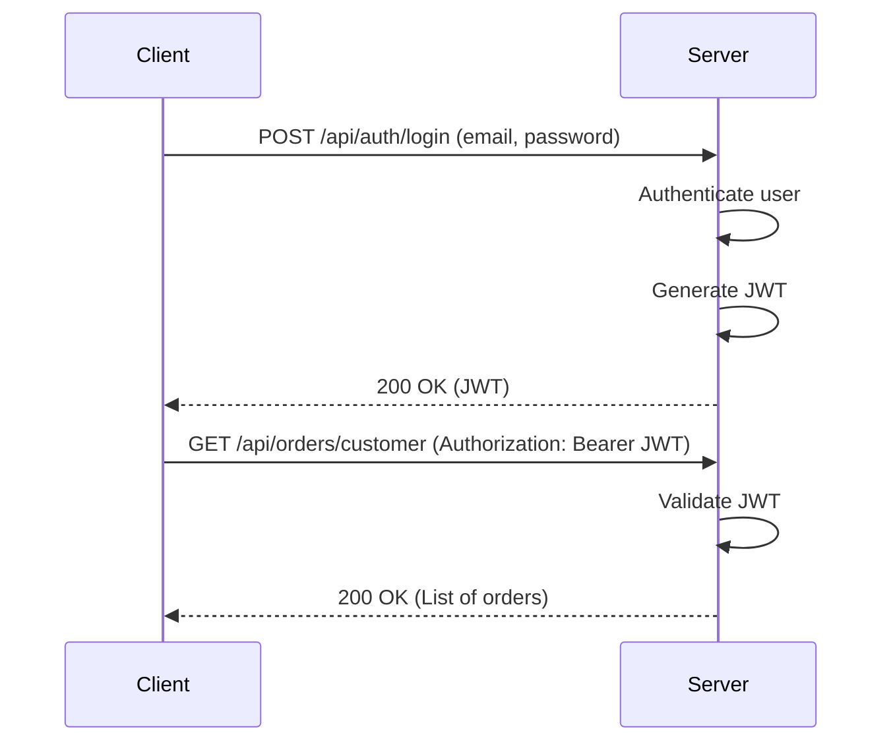

# Auntiees Food Order Management

This is a food order management system for Auntiees Cafe.

## Project Details

This project is a Spring Boot application that provides a REST API for managing food orders, users, and menu items. It uses JWT for authentication and authorization.

### Technologies Used:
- Java 17
- Spring Boot 3.3.4
- Spring Security
- Spring Data JPA (Hibernate)
- MariaDB
- Lombok
- JWT (jjwt)
- Thymeleaf (for email templates)

## Endpoints

### Authentication

| Method | Endpoint             | Description                                                              | Access      |
|--------|----------------------|--------------------------------------------------------------------------|-------------|
| POST   | `/api/auth/register`   | Registers a new user. An OTP is sent to the user's email for verification. | Public      |
| POST   | `/api/auth/login`      | Authenticates a user and returns a JWT token.                            | Public      |
| POST   | `/api/auth/verify-otp` | Verifies the OTP sent to the user's email to activate the account.       | Public      |

### Admin & Cashier

| Method | Endpoint                   | Description                               | Access      |
|--------|----------------------------|-------------------------------------------|-------------|
| GET    | `/api/admin/users/search`  | Search for customers by name or email.    | ADMIN, CASHIER |
| GET    | `/api/admin/users`         | Get all users.                            | ADMIN       |
| POST   | `/api/admin/users`         | Create a new user.                        | ADMIN       |
| PUT    | `/api/admin/users/{userId}/role` | Update a user's role.                     | ADMIN       |
| DELETE | `/api/admin/users/{userId}`  | Delete a user.                            | ADMIN       |
| POST   | `/api/admin/promote/initiate` | Initiates the process of promoting a user to ADMIN. An OTP is sent to the current admin's email. | ADMIN |
| POST   | `/api/admin/promote/confirm`  | Confirms the promotion of a user to ADMIN using the OTP. | ADMIN |

### Menu

| Method | Endpoint          | Description              | Access      |
|--------|-------------------|--------------------------|-------------|
| GET    | `/api/menu`       | Get all active menu items. | Public      |
| POST   | `/api/menu`       | Add a new menu item.     | ADMIN       |
| PUT    | `/api/menu/{id}`  | Update a menu item.      | ADMIN       |
| DELETE | `/api/menu/{id}`  | Delete a menu item.      | ADMIN       |

### Orders

| Method | Endpoint                   | Description                               | Access      |
|--------|----------------------------|-------------------------------------------|-------------|
| POST   | `/api/orders`              | Create a new order.                       | CUSTOMER, CASHIER |
| GET    | `/api/orders/customer`     | Get all orders for the authenticated customer. | CUSTOMER    |
| GET    | `/api/orders/admin/all`    | Get all orders.                           | ADMIN       |
| GET    | `/api/orders/admin/user/{userId}` | Get all orders for a specific user. | ADMIN       |
| GET    | `/api/orders/kitchen`      | Get all active kitchen orders.            | KITCHEN     |
| PUT    | `/api/orders/{orderId}/status` | Update the status of an order.          | KITCHEN, ADMIN |

## Security

This application uses Spring Security with JWT for authentication and authorization. The `/api/auth` endpoints are public, while all other endpoints require authentication and authorization.

The roles are:
- `CUSTOMER`: Can place orders and view their own order history.
- `CASHIER`: Can create orders for customers and guests, and search for customers.
- `KITCHEN`: Can view and update the status of active kitchen orders.
- `ADMIN`: Can manage users, menu items, and all orders.

## JWT Flow



## Payloads

### Create Order Request

This endpoint accepts two types of payloads: one for registered customers and one for guests.

**For a registered customer:**
```json
{
  "items": [{ "menuItemId": "item-1", "quantity": 2 }],
  "total": 25.00,
  "customerId": "user-id-123"
}
```

**For a guest:**
```json
{
  "items": [{ "menuItemId": "item-2", "quantity": 1 }],
  "total": 12.50,
  "guestName": "John Doe"
}
```
